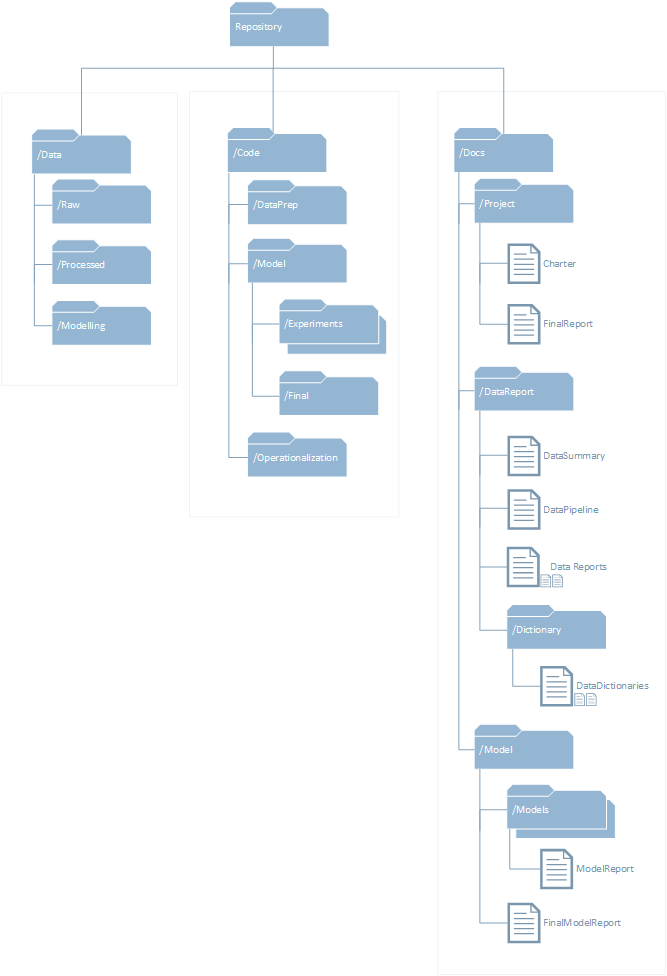

# Data Science Project Template

## Description
This repository contains a blank project template to be used during the course of a data science project. The standard directory structure
streamlines the organization of code, data and documentation to more easily leverage prior knowledge and improves quality by ensuring clear
organization of experimental assets.

The project template enforces the utilization of Git source control to ensure proper management and backup of source code while facilitating
a collaborative workflow through the use of branching.

## Instructions
When starting a new project, clone this repository to your new project's empty Git repository. This will provide your project with the following directory structure and templates:

### /Data
* **/Raw** - Contains raw data as received
* **/Processed** - Data state after pre-processing (normalization, outlier removal, joins, generic engineered features, etc.)
* **/Model** - Data as provided to the model. May be split, include model-specific synthetic features, etc.

### /Code
* **/DataPrep** - Contains code related to the preparation of data for modeling. Generally consumes data from /Data/Raw and outputs to /Data/Processed
* **/Model** - All code involved in the generation of models is included here. Iterations are stored in individual Experiment folders, and the final model code is migrated to a Final folder. Final data configurations (i.e. splits, unique features, etc.) should be exported to /Data/Model
   * **/ExperimentN (multiple)** - Individual experimental iterations
   * **/Final** - Final model generation code
* **/Operationalization** - Code to deploy the final model. Note that in many cases this may be an example only, leaving final operational code for a separate repository specifically formatted for deployment

### /Docs
* **/Project** - Administrative documents capturing the scope and results of the project. Should be the landing zone for familiarizing oneself with the project
  * **Charter.md** - Project charter setting scope and performance targets for the project
  * **FinalReport.md** - Includes a description of the project solution and final performance
* **/DataReport** - Explanatory documents for the datasets used in the project
  * **DataSummary.md** - A summary of data assets used in the project, including raw, processed and modeling states
  * **DataPipeline.md** - Documentation of the data pipelines to ingest data, and if available, an architecture for operational data pipelines
  * **DataReportN.md (multiple)** - A detailed report of individual datasets used in the project
  * **/Dictionary**
    * **DataDictionaryN.md (multiple)** - Definitions of columns/features in the individual datasets to provide easy future reference to the significance of features. Similar to content contained in DataReportN.md, but stripped of additional context (i.e. variable importance)
* **/Model**
  * **FinalReport.md** - Detailed summary report of final model attributes and performance
  * **/Models**
    * **ModelReportN.md (multiple)** - Detailed reports of model attributes and performance

## Citations
This is built upon the Microsoft [Team Data Science Process](https://blogs.technet.microsoft.com/machinelearning/2016/10/11/introducing-the-team-data-science-process-from-microsoft/)
